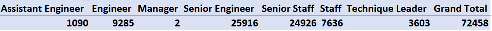

# Pewlett-Hackard-Analysis

## Project Overview
The purpose of this activity is twofold:
1. To determine the impending retirements from current staff
2. To determine employees eligible for establishing a mentorship program

## Results
1. Of the expected retirements, the majority of the 72,458 individuals fall in the Senior Engineer (25,916) and Senior Staff (24,926) titles.

2. Conversely, only two managers are expected to retire.

3. In the available pool of pending retirees, only 1,549 employees eligible for the mentorship program.

4. Most of these fall under Staff (420), Senior Staff (304), Senior Engineer (398), and Engineer (302).

## Summary
Effectively, 72,458 roles will need to be filled in the upcoming "silver tsunami."  With this in mind, only 1,549 employees are currently qualified to serve as mentors in the new program.  With roughly 2% of the total potential retirees being eligible, there may need to be a targeted approach.  ne possible additional query could be to assess which specific departments have the greatest need.  Seperately, another query could be run on retiring gender, as the company may likely consider that in maintaining diversity in the workforce.
